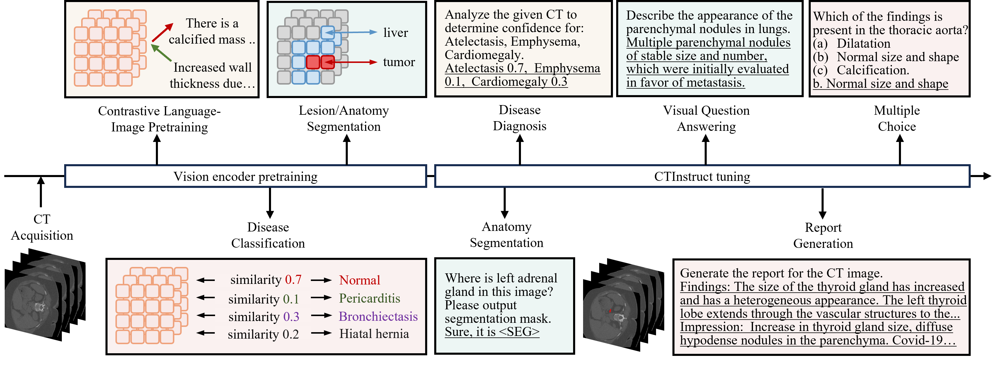

<h1> CTInstruct </h1>

The official codes for "Versatile Vision-Language Model for 3D Computed Tomography" published in AAAI 2026.

<!-- <div style='display:flex; gap: 0.25rem; '>
<a href='https://huggingface.co/JiayuLei/AutoRG_Brain'></a>
<a href='https://huggingface.co/datasets/JiayuLei/RadGenome-Brain_MRI'></a>
</div> -->

## Introduction
In this paper, we propose CTInstruct, a novel MVLM
employing a hybrid ResNet-ViT encoder with multi-granular
vision-language pretraining for efficient heterogeneous data
modeling, and unified instruction tuning that jointly optimizes
discriminative, generative, and voxel-level reasoning
for volumetric medical imaging. In general, we present the contribution from the following aspects: 
1. **Multi-Granular Vision Pretraining.** We propose the first vision encoder pretraining strategy that jointly optimizes volume-level semantic alignment, disease classification,
and voxel-wise segmentation using heterogeneous data resources, enabling holistic spatial-semantic feature learning for volumetric medical data.

2. **Extensive Vision Encoder Ablations for MVLM.** Our extensive ablations reveal that a hybrid ResNet-ViT trained with multi-granular alignment on heterogeneous data maximizes downstream performance, achieving data-efficient medical representation learning.

3. **CTInstruct.** A novel MVLM that unifies discriminative and generative capabilities through multi-granular pretraining leveraging heterogeneous CT annotations and multi-task instruction tuning. In the experiment, CTInstruct achieves new SOTA results across 8 CT benchmarks spanning segmentation, diagnosis, and generation. 




## Model Inference

Download our [**CTInstruct Model**](https://huggingface.co/JiayuLei/CTInstruct) 

Prepare the data file, a possible example is shown in folder 'data\instruction_sft\VQA_CTRATE_example.json'

```json
[
  {
      "question": [
          {
              "type": "image"
          },
          {
              "type": "text",
              "text": "What are the findings in the lung parenchyma of the Chest CT image?"
          }
      ],
      "image_path": [
          "path/to/your/image.nii.gz"
      ],
      "answer": "A few millimetric nonspecific nodules and mild recessions are observed in the upper lobe and lower lobe of the right lung."
  }
]
```

Run the inference
```shell
TOKENIZERS_PARALLELISM=False deepspeed --master_port 29501 --include localhost:0 evaluate_CTInstruct.py
```

## Model Training

### Vision Encoder Pretraining

```shell
### Train 2D1D Vision Encoder
TOKENIZERS_PARALLELISM=False deepspeed --master_port 29051 --include localhost:0,1,2,3,4,5,6,7 train_encoder_2D1D.py

### Train 3D ViT Vision Encoder
TOKENIZERS_PARALLELISM=False deepspeed --master_port 29051 --include localhost:0,1,2,3,4,5,6,7 train_encoder_ViT3D.py

### Train 3D ResNet Vision Encoder
TOKENIZERS_PARALLELISM=False deepspeed --master_port 29051 --include localhost:0,1,2,3,4,5,6,7 train_encoder_ResNet3D.py
```

### CTInstruct Training

```shell
TOKENIZERS_PARALLELISM=False deepspeed --master_port 29501 --include localhost:0,1,2,3 train_CTInstruct.py
```


## Contact
If you have any questions, please feel free to contact misslei@mail.ustc.edu.cn.

<!-- ## Citation
```bibtex

``` -->
